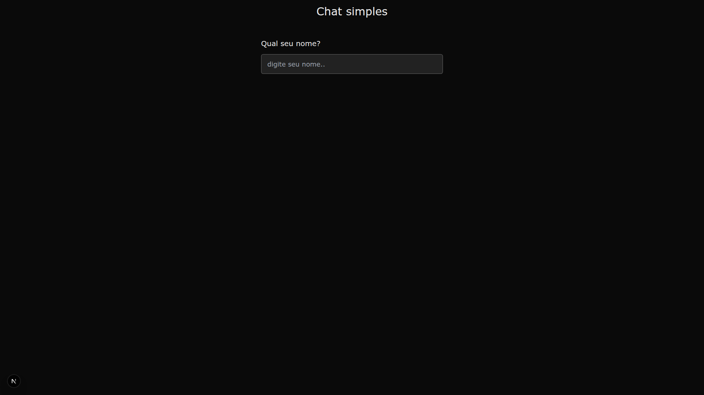
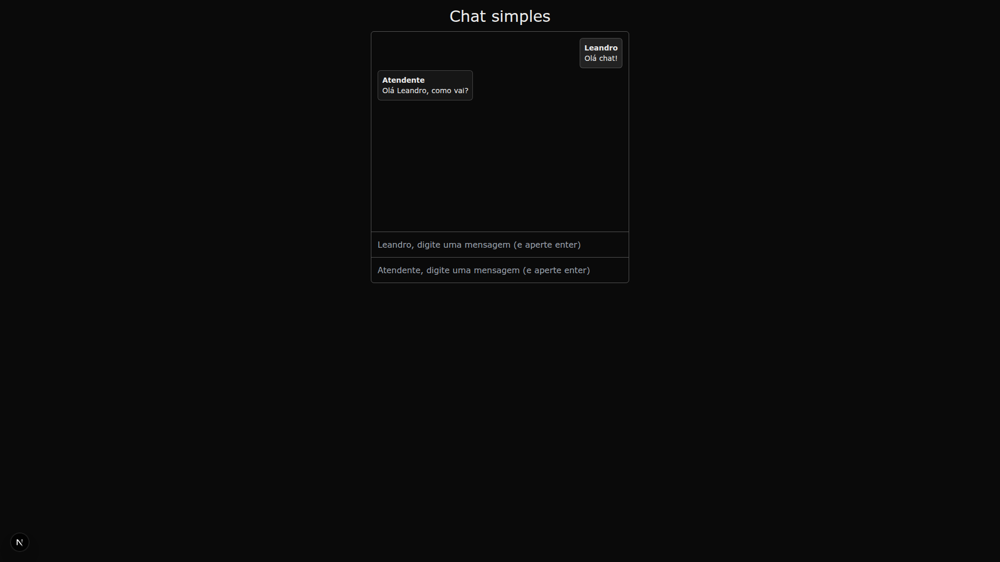

# 💬 Chat Simples com React + Context API

Projeto de um chat simples desenvolvido com **React**, **TypeScript** e **Tailwind CSS**, utilizando **Context API + useReducer** para gerenciamento de estado.

---

## 🚀 Tecnologias Utilizadas

- React.js
- TypeScript
- Tailwind CSS
- Context API
- useReducer e useState

---

## 🧠 Funcionalidades

- Entrada do nome do usuário antes de iniciar o chat
- Histórico de mensagens visível em tempo real
- Envio de mensagens por dois participantes (usuário e atendente)
- Organização do estado global com Context API
- Estilização responsiva com Tailwind CSS

---

## 📂 Estrutura

src/
├── components/
│ ├── Chat.tsx
│ ├── ChatInput.tsx
│ ├── ChatMessages.tsx
│ └── UserInput.tsx
├── contexts/
│ ├── ChatContext.tsx
│ └── UserContext.tsx
├── reducers/
│ └── chatReducer.ts
├── types/
│ └── Message.ts
└── app/
└── page.tsx

---
## Tela inicial

## Chat

## 🧪 Como rodar o projeto localmente

# 3. Instale as dependências
npm install

# 4. Rode o projeto
npm run dev
