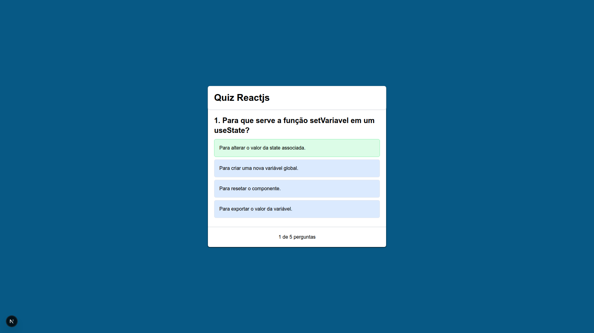
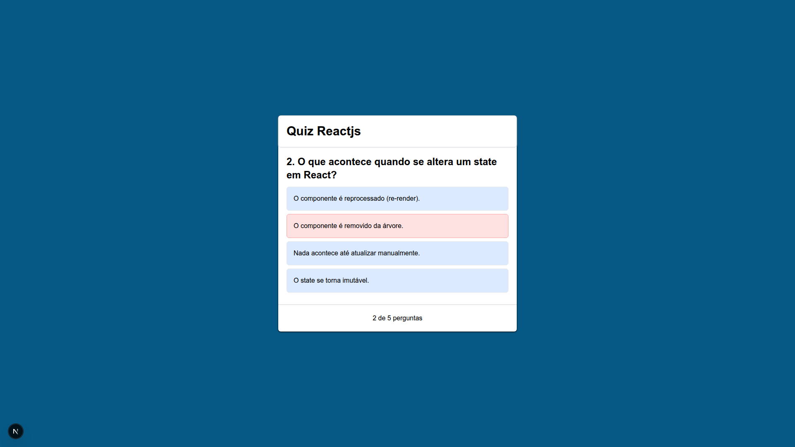

# ⚛️ Quiz ReactJS

Este é um projeto de um **Quiz interativo** criado com ReactJS e TypeScript. O objetivo é testar seus conhecimentos sobre React de forma divertida e funcional! 🧠✨

---

## 🚀 Tecnologias Utilizadas

- ✅ [ReactJS](https://react.dev/)
- ✅ [TypeScript](https://www.typescriptlang.org/)
- ✅ [Tailwind CSS](https://tailwindcss.com/)
- ✅ [Vite](https://vitejs.dev/) *(provavelmente, se estiver usando)*
- ✅ [Next.js App Router](https://nextjs.org/docs/app)

---

## 🧩 Funcionalidades

- Exibição de perguntas com 4 alternativas.
- Destaque visual da resposta correta e incorreta.
- Transição automática para a próxima pergunta.
- Tela de resultados com acertos e correções.
- Botão para reiniciar o quiz.
- Interface simples, responsiva e intuitiva.

---

## 📚 O que eu aprendi

Durante o desenvolvimento deste projeto, aprendi:

- Como criar componentes reutilizáveis no React (`<QuestionItem />`, `<Results />`);
- Utilização prática de `useState` para controlar múltiplos estados simultaneamente;
- Manipulação de arrays com `map()` para exibir perguntas e respostas dinamicamente;
- Como aplicar lógica condicional para mostrar resultados e mudar de etapa;
- Estilização com Tailwind CSS;
- Estruturação de projetos com **Next.js App Router**;
- A importância de componentizar e manter o código limpo e legível.

---

